# AI Toolhouse — User Guide

> This guide is for studio users. No technical knowledge required.

---

## Table of Contents

1. [Installation & First Launch](#1-installation--first-launch)
2. [Logging In](#2-logging-in)
3. [The Home Screen](#3-the-home-screen)
4. [The Sidebar](#4-the-sidebar)
5. [Output Paths](#5-output-paths-client--project--filename)
6. [Magnific Upscaler](#6-magnific-upscaler)
7. [Batch Upscaler](#7-batch-upscaler)
8. [Outfit Swapping](#8-outfit-swapping)
9. [Image Edit](#9-image-edit)
10. [Image Prompting](#10-image-prompting)
11. [Video Creation](#11-video-creation)
12. [Panorama Outpainting](#12-panorama-outpainting)
13. [Custom Tools](#13-custom-tools)
14. [Gallery](#14-gallery)
15. [Updates](#15-updates)

---

## 1. Installation & First Launch

1. Download the latest installer (`AI-Toolhouse-Setup-x.x.x.exe`) from the shared release location.
2. Run the installer and follow the on-screen steps. No admin rights required.
3. A desktop shortcut and Start Menu entry are created automatically.
4. On first launch, a **Settings** window appears asking for the backend URL. Enter the address your IT contact provided and click **Save**.

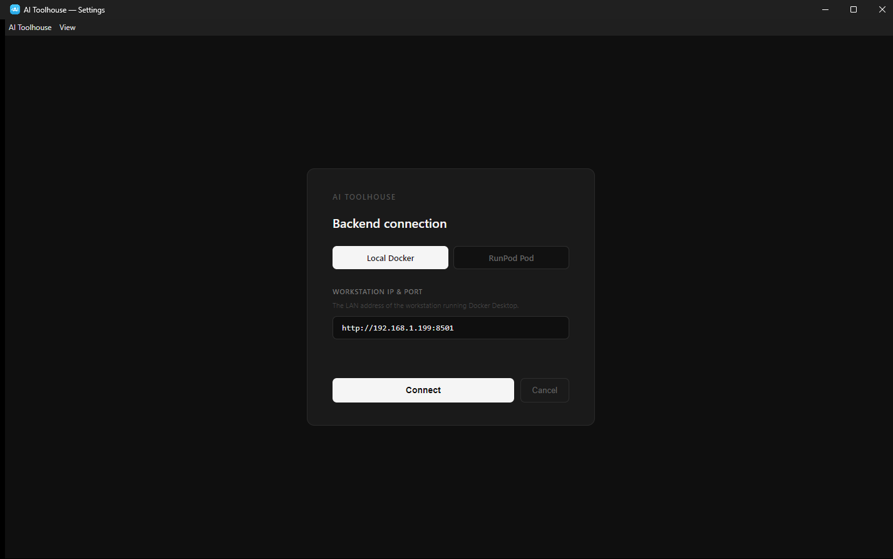

You only need to do this once. The app remembers your setting between sessions.

---

## 2. Logging In

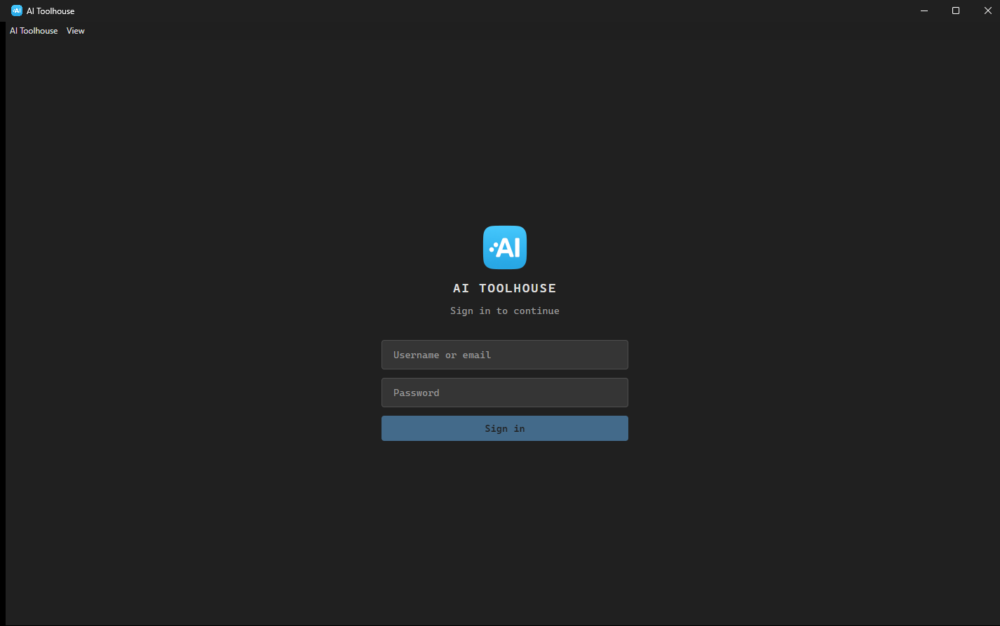

Enter your username and password and click **Log in**. Your session stays active until you log out manually — you will not be asked to log in again each time you open the app.

To log out, click your username in the top-right corner and select **Log out**.

---

## 3. The Home Screen

After logging in you land on the **Home screen**, which shows all the tools available to your account as tiles.

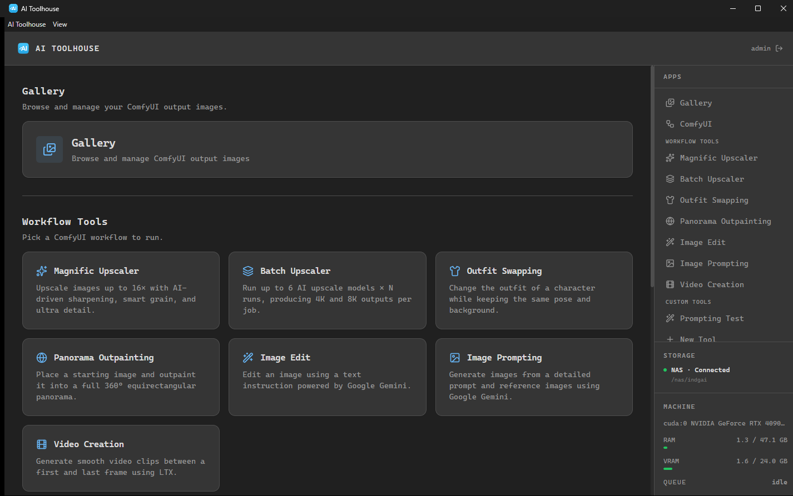

- Tools you do not have access to will not appear.
- Click any tile to open that tool.
- Click the **AI Toolhouse** logo in the top-left at any time to return here.

---

## 4. The Sidebar

While inside a tool, a sidebar is visible on the right side of the screen.

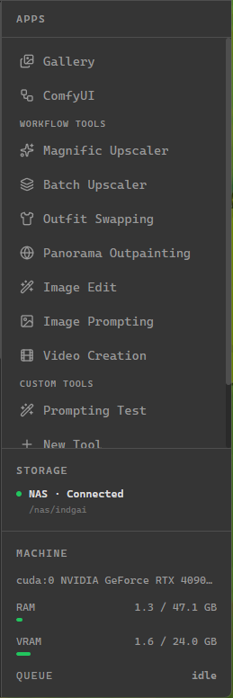

| Section | What it shows |
|---|---|
| **Apps** | Quick links to all your tools — click any to switch directly |
| **Storage** | Whether the NAS storage is reachable (green dot = connected) |
| **Machine** | Live GPU, RAM, and VRAM usage of the server |
| **Queue** | Whether the AI server is currently busy or idle |

---

## 5. Output Paths (Client / Project / Filename)

Most tools have an **Output Path** section at the bottom of the left panel.

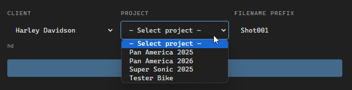

| Field | Purpose |
|---|---|
| **Client** | The client folder your output is saved under |
| **Project** | Sub-folder within that client |
| **Filename prefix** | Optional text prepended to every output filename |

These fields are optional. If left empty, files are saved to a default location. Filling them in keeps the Gallery organised and makes it easier to find your work later.

---

## 6. Magnific Upscaler

**What it does:** Enlarges a single image to a higher resolution using AI — up to 16× the original size.

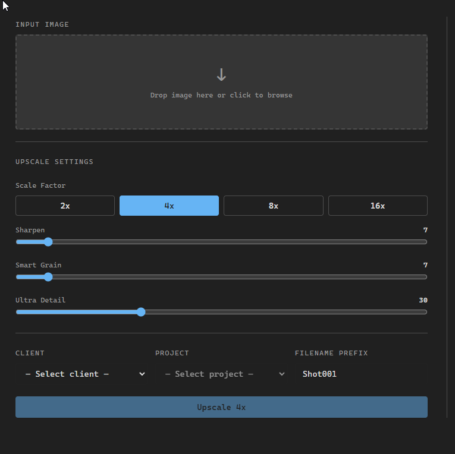

### Steps

1. Drag your image onto the upload area, or click it to browse for a file.
2. Choose your **Scale** — 2×, 4×, 8×, or 16×.
3. Adjust the three quality sliders to taste:
   - **Sharpen** — increases edge crispness (0–100)
   - **Smart Grain** — adds subtle film grain to hide AI artefacts (0–100)
   - **Ultra Detail** — pushes fine detail recovery (0–100)
4. Fill in the Output Path if needed.
5. Click **Upscale**.

The result appears on the right side. Click **Download** to save it.

> **Tip:** For clean product photos, keep Smart Grain low. For organic / lifestyle images, a small amount of grain (10–20) looks more natural.

---

## 7. Batch Upscaler

**What it does:** Runs one image through several AI upscale models in parallel, giving you a set of variations to choose the best result from. Each model runs at both 4K and 8K.

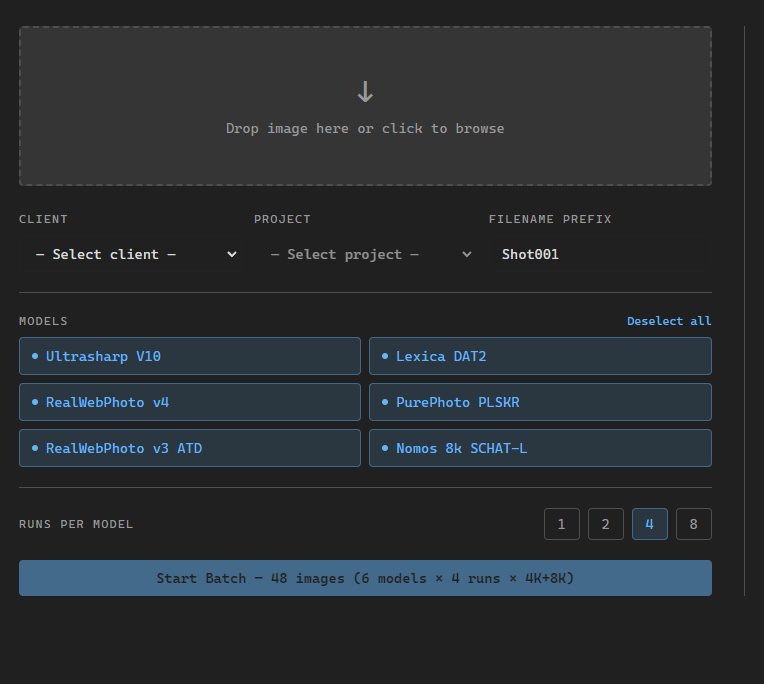

### Steps

1. Upload your image.
2. Tick the **models** you want to compare (you can select multiple).
3. Set **Runs per model** — how many times each model processes the image (more runs = more variation to choose from).
4. Note the button label — it tells you exactly how many images will be generated, e.g. *"Start Batch — 48 images (6 models × 4 runs × 4K+8K)"*.
5. Click **Start Batch**.

Progress is shown per model with coloured status dots:
- **Grey** — queued
- **Blue / spinning** — processing
- **Green** — done
- **Red** — error

When all runs are complete, click **Download ZIP** to get all results at once.

---

## 8. Outfit Swapping

**What it does:** Applies outfit items from reference images onto a subject photo using AI.

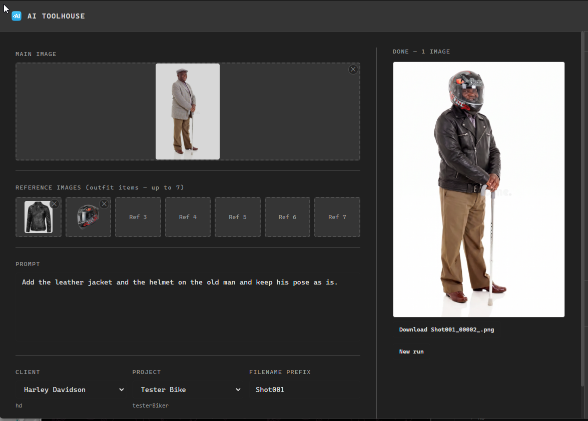

### Steps

1. Upload your **main image** — the person or subject who will wear the outfit.
2. Upload up to **7 reference images** — garments, accessories, or style references you want applied.
3. Edit the **prompt** to describe the desired result. A starting template is pre-filled — adjust it to match your references.
4. Set the Output Path if needed.
5. Click **Generate**.

The result appears on the right when complete.

> **Tip:** The more specific your prompt, the better the result. Name the items visible in your reference images (e.g. "white linen blazer, wide-leg trousers").

---

## 9. Image Edit

**What it does:** Modifies an existing image based on a plain-language instruction, with optional reference images for style guidance.

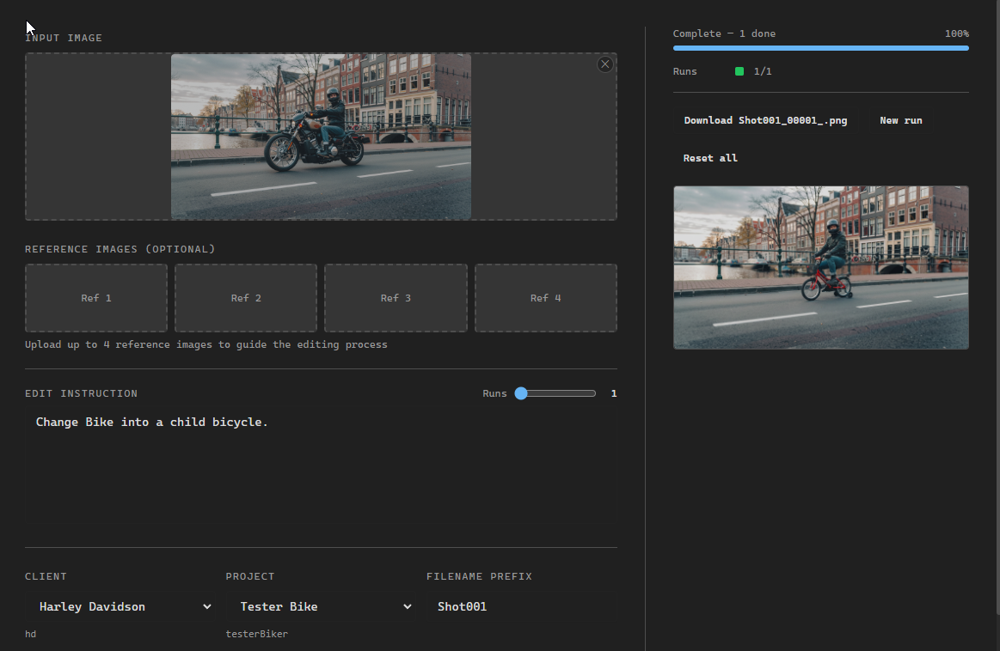

### Steps

1. Upload the **image you want to edit**.
2. Optionally upload up to **4 reference images** to guide the style or look.
3. Type your **Edit Instruction** — describe what should change, e.g. *"change the bike colour to bright yellow"* or *"replace the background with a forest"*.
4. Use the **Runs** slider to generate multiple variations in one go (1–10).
5. Set the Output Path if needed.
6. Click **Generate**.

Results appear below the progress bar. If you generated multiple runs, all versions are shown side by side. Use **Download ZIP** to get them all.

---

## 10. Image Prompting

**What it does:** Generates new images from a text description. Reference images can be provided to guide composition, style, or specific elements.

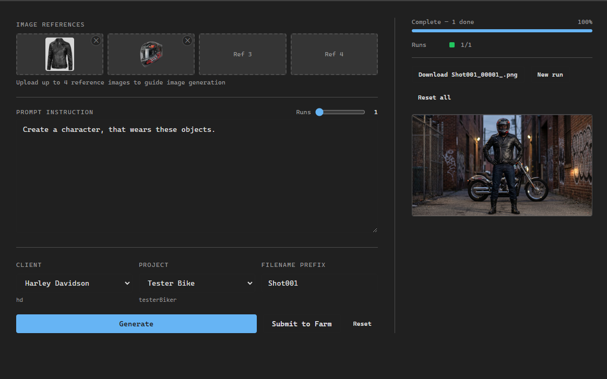

### Steps

1. Optionally upload up to **4 reference images** — these guide the output but are not required.
2. Write your **prompt** — describe what you want to create in as much detail as possible.
3. Set the number of **Runs** (1–10) to generate variations.
4. Set the Output Path if needed.
5. Click **Generate**.

Each run is tracked with its own status indicator. When done, click individual images to download, or use **Download ZIP** for all.

#### Submitting to the Render Farm

If your studio uses Deadline (a render farm), an additional **Submit to Farm** button is available. This queues the job on the farm instead of running it immediately on the local server — useful for large batch jobs that would otherwise block the queue.

---

## 11. Video Creation

**What it does:** Generates a short AI video that transitions between two keyframe images.

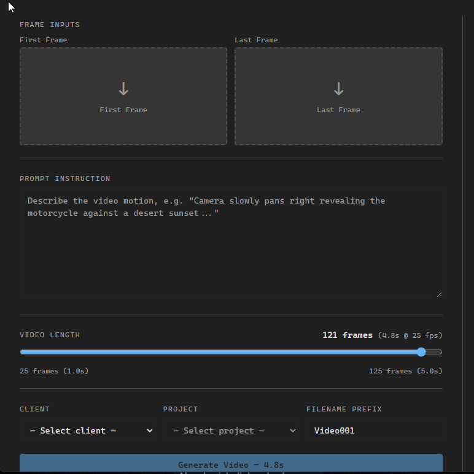

### Steps

1. Upload the **First Frame** — where the video begins.
2. Upload the **Last Frame** — where the video ends.
3. Write a **prompt** describing the motion or transformation between the two frames, e.g. *"Camera slowly pans right across a sun-lit studio"*.
4. Set the **Length** using the slider (25–125 frames — the label shows the equivalent duration in seconds at 25 fps).
5. Set the Output Path if needed.
6. Click **Generate**.

The finished video plays directly in the app when complete. Click **Download** to save it.

---

## 12. Panorama Outpainting

**What it does:** Expands a partial image into a full 360° equirectangular panorama using AI.

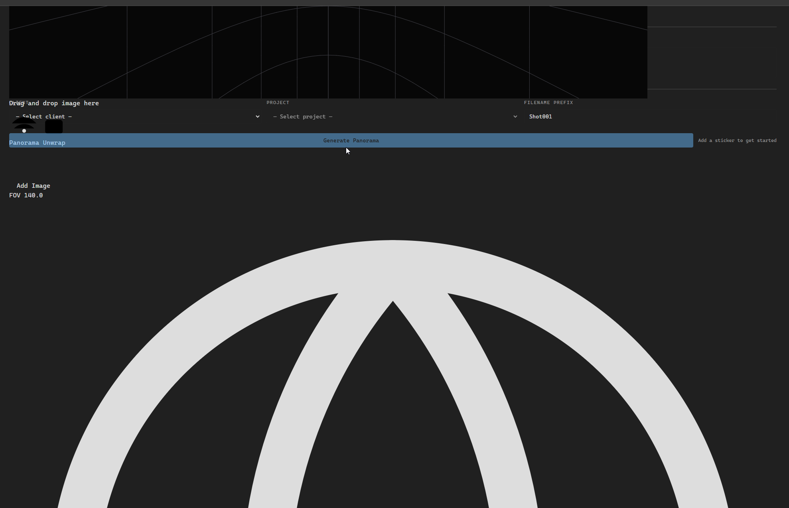

### Steps

1. Upload your **base image** — this is the section of the panorama you already have.
2. Use the canvas editor to place **stickers** on the areas you want the AI to fill in. The stickers mark the regions to outpaint.
3. Adjust the **prompt** to describe the style and content of the filled areas. A template is pre-filled.
4. Set the Output Path if needed.
5. Click **Generate** (the button is greyed out until at least one sticker is placed).

The completed 360° panorama replaces the canvas preview when done.

> **Tip:** Place stickers generously — it is better to mark too large an area than too small, as the AI handles blending at the edges.

---

## 13. Custom Tools

Custom Tools are tools built by your admin directly from ComfyUI workflows. They appear alongside the standard tools in the sidebar and home screen and work the same way — fill in the fields and click **Run**.

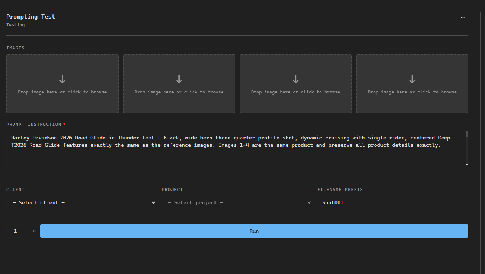

Each custom tool is different. Ask your admin what a specific tool does.

#### Batch Mode

Most custom tools support batch runs. Set the **Batch count** (1–50) and click **Start Batch** to run the tool multiple times with the same settings. Results appear one by one as each run completes, and you can download all of them as a ZIP when the batch is done.

---

### 13a. Building a Custom Tool (Admin only)

Admins can create new custom tools from any ComfyUI workflow using the **Workflow Builder** wizard. Click **+ New Tool** at the bottom of the sidebar to start.

#### Before you begin — two requirements

**1. Export the workflow in API format**

The Workflow Builder needs the workflow's *API JSON*, not the regular save file. In ComfyUI:

1. Open **Settings** (gear icon, top-right)
2. Enable **Dev Mode**
3. Close Settings — the top bar now shows a **Save (API Format)** button
4. Click it to download the `.json` file

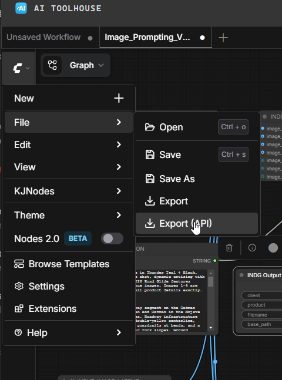

> **Important:** A workflow saved with the regular *Save* button will not work — the Workflow Builder will show "No configurable inputs found" if you upload the wrong format.

**2. Use INDG custom nodes for output saving**

For a custom tool to save its results to the studio's storage (and show the Client / Project / Filename fields to the user), the workflow must contain an **INDGOutputPath** node. This is a custom node maintained by INDG that tells ComfyUI where to write the output file.

If the workflow uses a standard ComfyUI Save Image node, results will save to ComfyUI's default output folder and the output path picker will not appear in the tool. Ask your pipeline TD to add an INDGOutputPath node if it is missing.

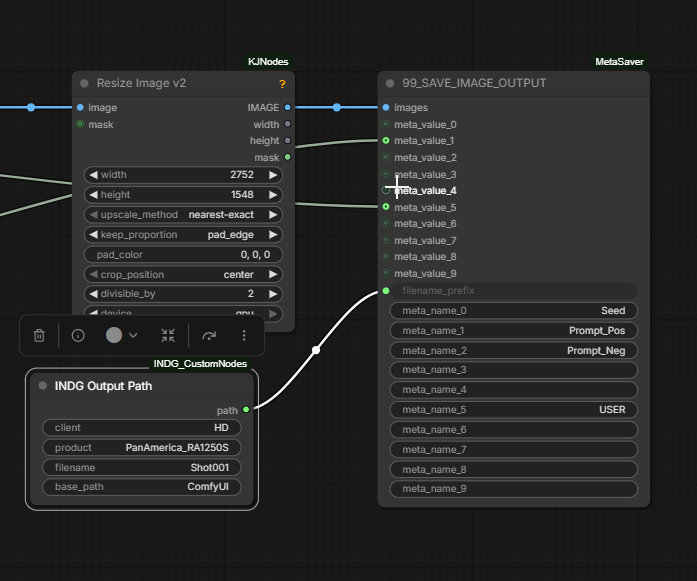

---

#### Step 1 — Upload the workflow

Drop your API-format `.json` onto the upload zone (or click to browse).

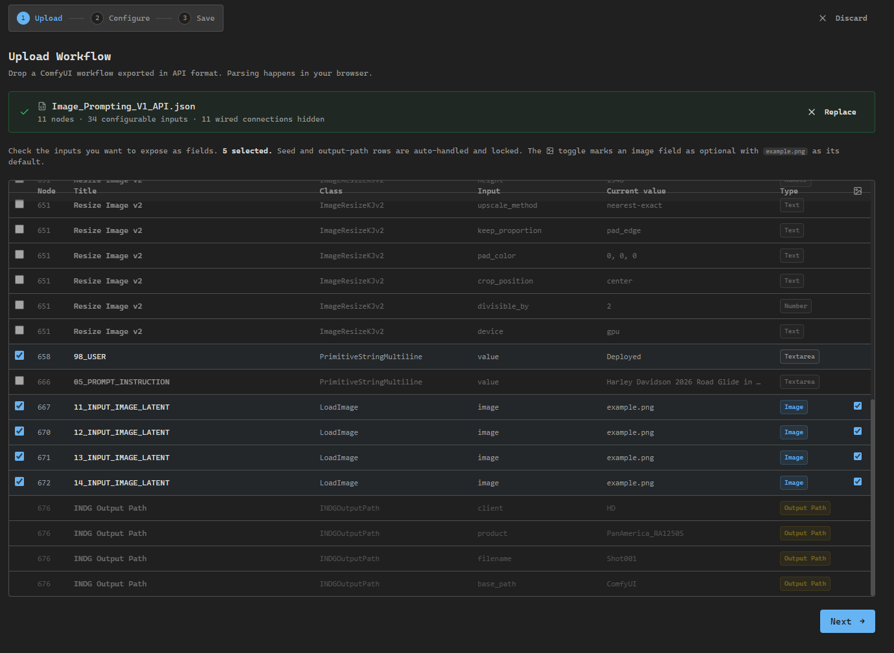

The app scans the workflow and shows an **inspection table** listing every configurable input it found. Each row shows:

| Column | Meaning |
|---|---|
| **Node** | The ComfyUI node ID |
| **Title** | The node's title as set in ComfyUI |
| **Type** | What kind of field was detected (see below) |

**Detected types explained:**

| Badge | Meaning |
|---|---|
| Image | An image upload slot |
| Text | A short text input |
| Textarea | A longer text/prompt field |
| Number | A numeric value |
| Slider | A value with a min/max range |
| Select | A dropdown with fixed options |
| Toggle | An on/off switch |
| Auto · seed | Random seed — handled automatically, no user input needed |
| Auto · user | Username — injected automatically at run time |
| Output Path | The INDGOutputPath node — handled automatically |

**Tick the inputs you want to expose** as fields in the finished tool. Auto and Output Path rows are locked — they are always included and require no configuration.

For image inputs, the image column on the far right lets you mark the field as *optional* (it will use a built-in placeholder image if the user leaves it empty).

Click **Next** when you have selected at least one field.

---

#### Step 2 — Configure fields

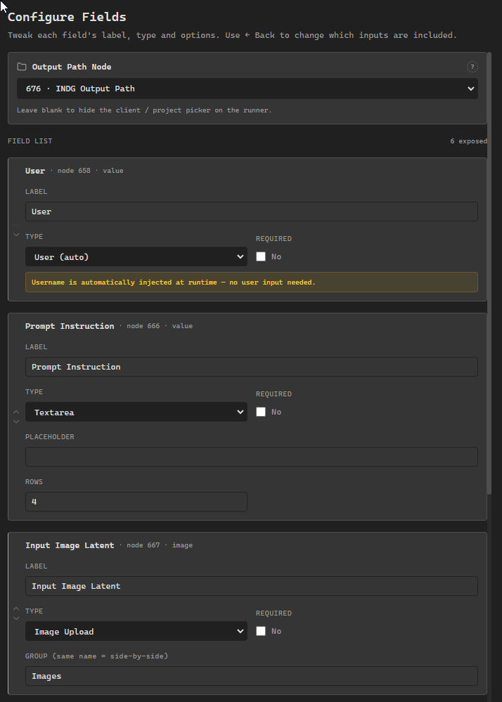

Each selected input becomes a **field card**. For every card you can set:

| Setting | Description |
|---|---|
| **Label** | The name shown to the user (e.g. "Reference Image", "Prompt") |
| **Type** | Override the auto-detected type if needed |
| **Required** | Whether the user must fill this field before running |
| **Placeholder** | Hint text for text / textarea fields |
| **Group** | Image fields with the same group name appear side by side in the tool |

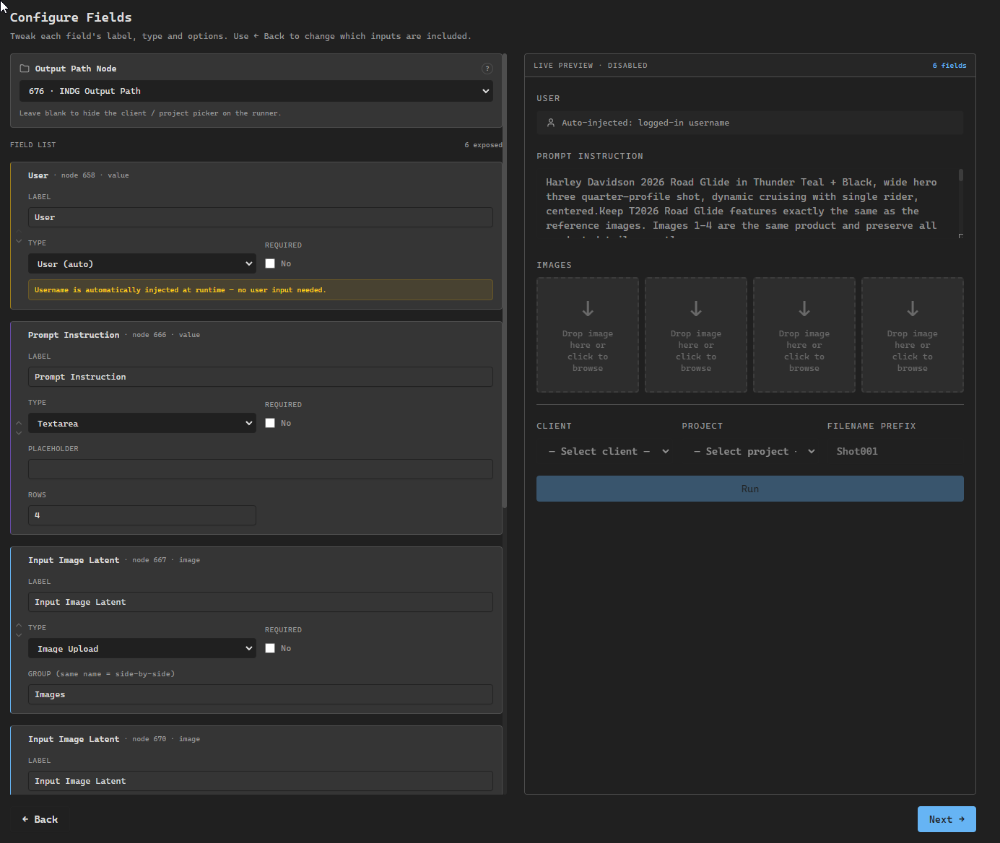

Use the **↑ ↓ arrows** on each card to reorder the fields — this controls the order they appear in the finished tool.

The **live preview** on the right updates as you make changes so you can see exactly what users will see.

If the workflow contains an INDGOutputPath node, an **Output Path Node** picker appears at the top of the panel. Select the correct node from the dropdown so the tool knows where to write its files.

Click **Next** when you are happy with the layout.

---

#### Step 3 — Name and save

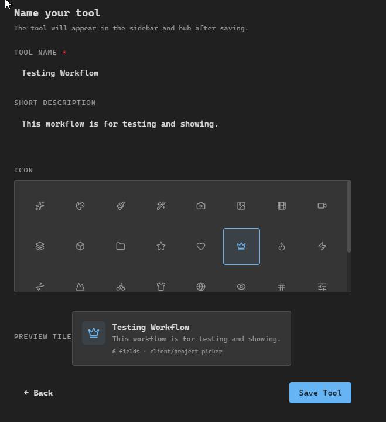

| Field | Description |
|---|---|
| **Tool name** *(required)* | Shown on the hub tile and in the sidebar |
| **Short description** | One-line summary shown under the name on the tile |
| **Icon** | Pick an icon from the grid — shown on the tile and in the sidebar |

The **preview tile** at the bottom shows exactly how the tool will look on the home screen.

Click **Save Tool**. The tool is immediately available to all users in the groups your admin assigns it to.

---

## 14. Gallery

The Gallery lets you browse, preview, and manage all AI-generated images saved on the server.

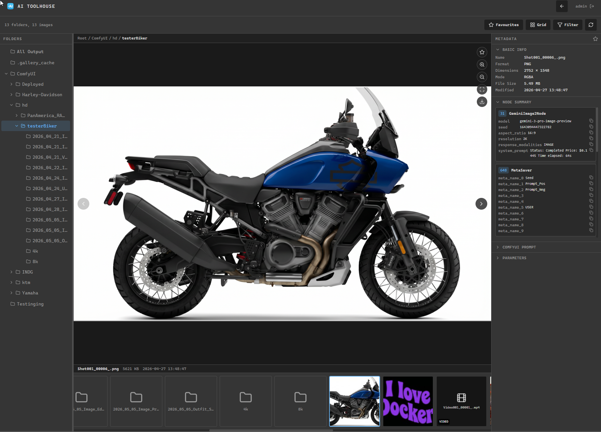

### Navigating Folders

The left panel shows a folder tree. Click any folder to browse its contents. The tree refreshes automatically every 10 seconds, so new outputs appear without needing to reload.

### Two View Modes

Switch between modes using the view toggle buttons in the top-right of the gallery.

**Detail View** (default)
- Large preview of the selected image
- Right panel shows: filename, format, dimensions, and creation metadata
- Use the **left / right arrow keys** on your keyboard to step through images quickly

**Grid View**
- Thumbnail overview of all images in the current folder
- Tick the checkboxes on images to select multiple at once
- Bulk actions appear at the top when images are selected

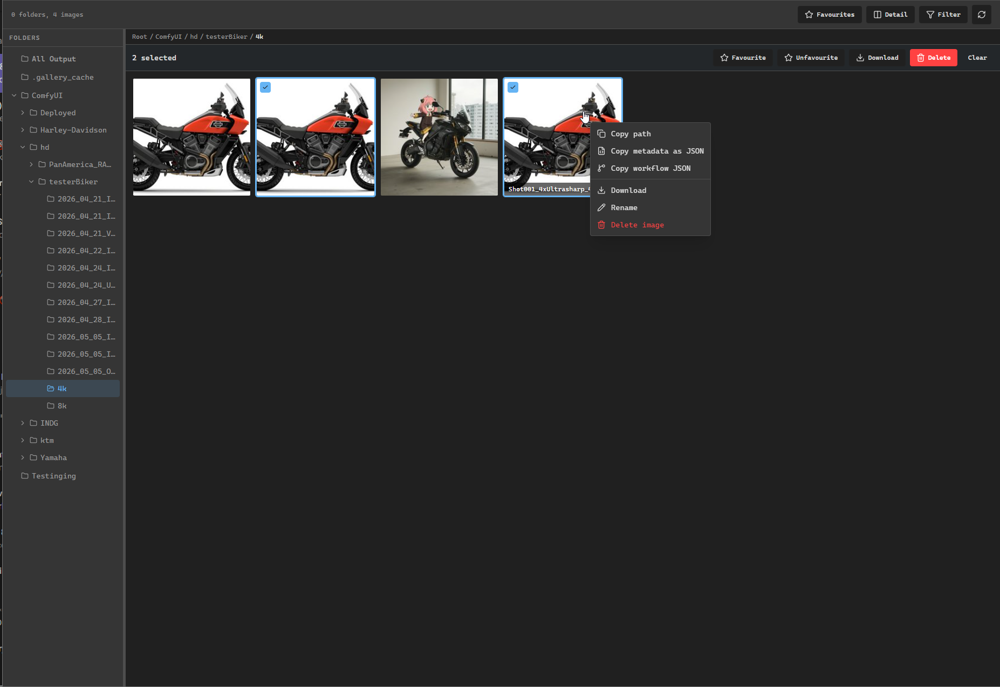

### Favourites

The **Favourites** button in the toolbar (star icon, top-right of the gallery) is a toggle. When active, the folder tree is replaced by a single flat list of every image you have starred — across all folders and all projects at once. This makes it easy to collect a shortlist of results without moving any files.

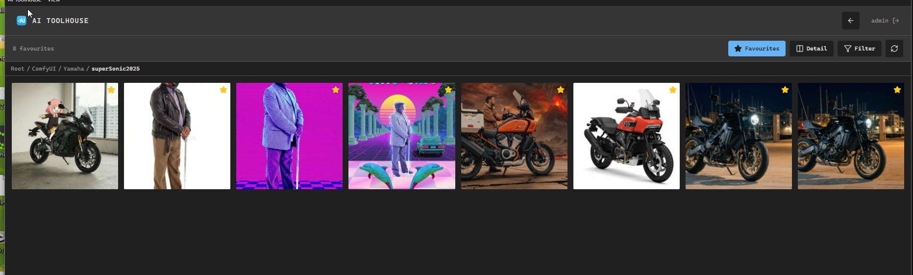

**Starring a single image — Detail View**

With an image selected in Detail View, click the star icon in the metadata panel on the right. The star fills in immediately. Click it again to unstar.

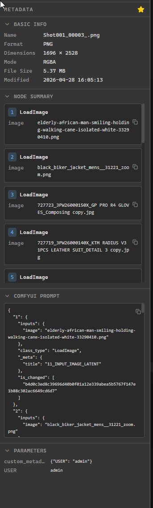

**Starring multiple images at once — Grid View**

1. Switch to **Grid View**
2. Tick the checkboxes on the images you want to act on
3. A bulk action bar appears at the top — click **Star selected** or **Unstar selected**

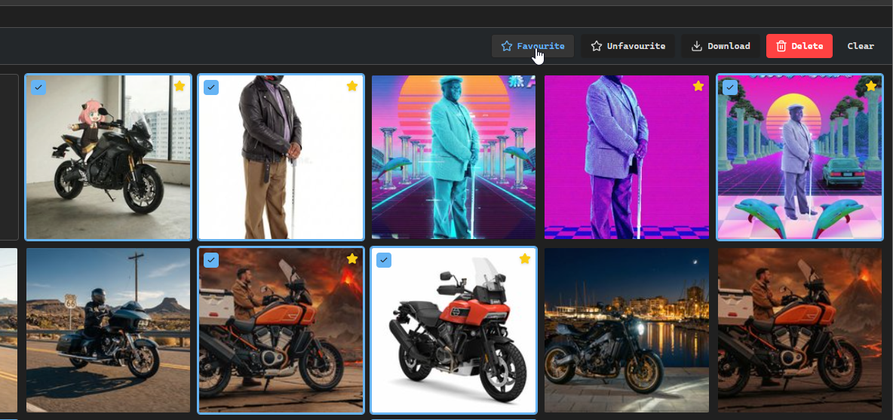

---

### Managing Images

| Action | How |
|---|---|
| **Favourite** | Star icon in the Detail View metadata panel, or bulk star in Grid View |
| **Rename** | Use the ⋯ menu → Rename, or right-click the image |
| **Move** | Drag the image to another folder in the tree |
| **Download** | Click the download icon in the Detail View metadata panel |
| **Delete** | Use the ⋯ menu for a single image, or select multiple in Grid View and use the bulk delete button |

> **Note:** Deleted images cannot be recovered. A confirmation prompt always appears before deletion.

---

## 15. Updates

AI Toolhouse updates itself automatically. When a new version is available and ready to install, a small dialog will appear:

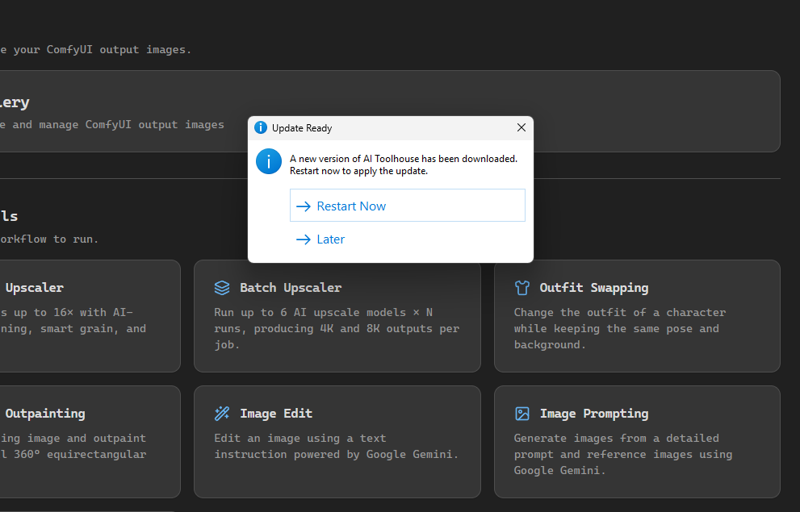

- **Restart Now** — closes the app and installs the update immediately. The app reopens on its own.
- **Later** — dismisses the dialog. The update will be installed the next time you restart the app normally.

You do not need to download or run any installer manually for updates after the initial installation.

---

*For technical issues or access problems, contact your system administrator.*
